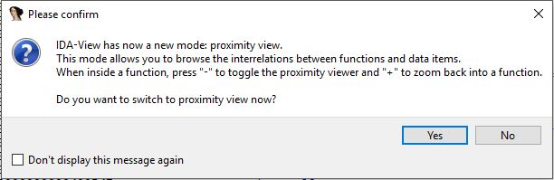

# Reversing a "Hello World" C program

- To start you can ~either~ 'gcc' hello-world.c ~or you can just download the precompiled one in this repository~.

1. First drop your file into IDA PRO, and make sure that the filetype selected is 'ELF64 for x86-64 (Executable) [elf64.l64]' and that the processor type is 'MetaPC', then press OK.

2. If available select 'No' to view without proximity view.

Decompiled.JPG)

3. There it is! The disassembled version of your compiled "Hello World!" c program.
