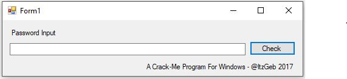
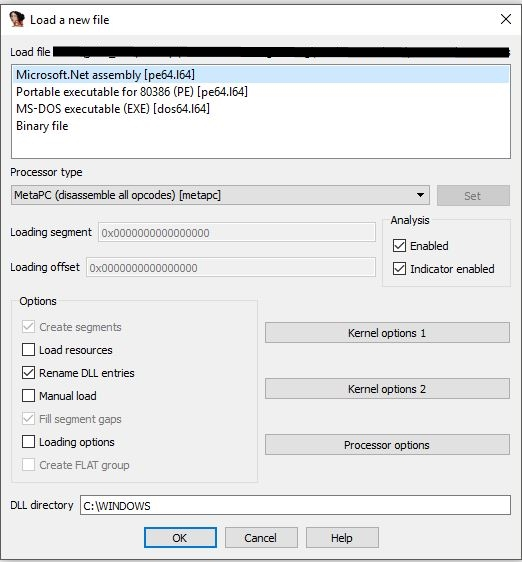
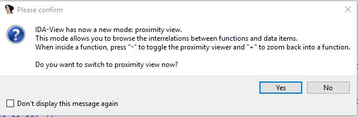
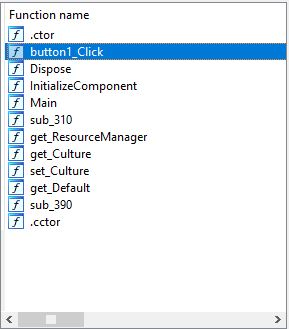
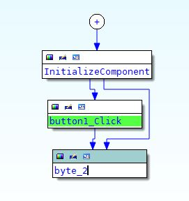
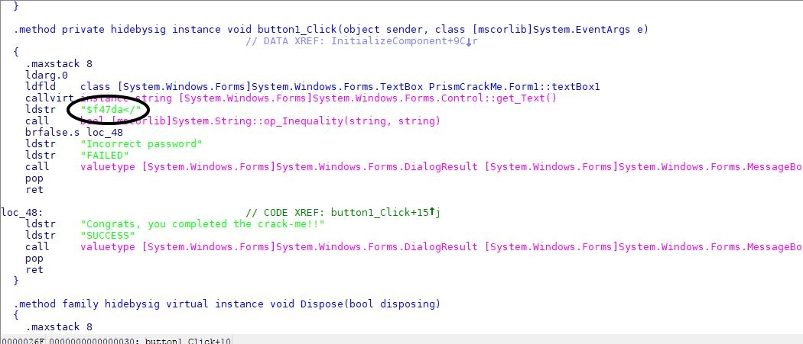
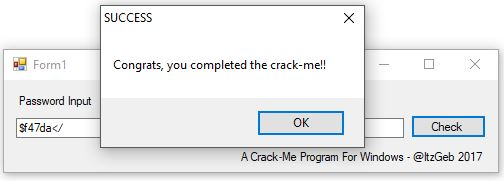
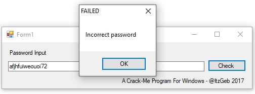
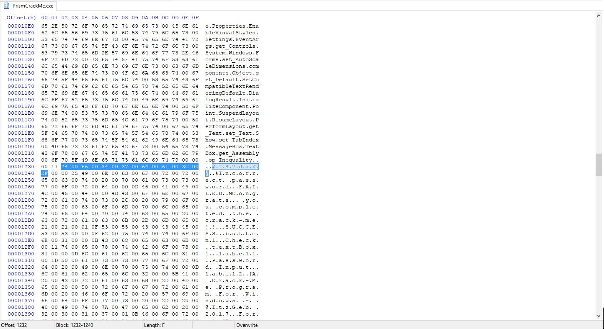

# Reversing <s>(+ patching)</s> a Windows "Crack-Me" Style Program

### <s>YOU NEED A WINDOWS MACHINE (physical or vm) IN ORDER TO COMPLETE THIS</s>   [Use Wine on Linux](https://www.winehq.org/) or [WineBottler on MacOS](https://winebottler.kronenberg.org/)

- Start by downloading the 'PrismCrackMe.exe' in this folder
  

1. First open the program, you can see we have a textBox for the password input, and a button that simply checks the contents of the textBox.

  
2. First drop your file into IDA PRO, and make sure that the filetype selected is 'Microsoft.Net assembly [pe64.l64]' and that the processor type is 'MetaPC', then press OK.
  

  
3. If available select 'Yes' to view with proximity view.
  

  
4. Now under 'Function name' in the top left double-click button1_Click
  

5. Double click on byte_2
  

6. Scroll down and bit and you should see 'ldstr "$f47da</"'. There it is, the password for the program. Copy the '$f47da</' string.

 

7. Now you can paste the password into the textBox and press check! If you got the success message congrats! If you didn't I don't know what to say.

Alternative Method 

1. Open PrismCrackMe.exe in [HxD](https://mh-nexus.de/en/hxd/).

2. Go to line 1230 and 2 columns over, you'll see the first 7 letters of the password with the last letter on the next line, 1240, in the first column.

3. Copying the password is simple, just copy the characters of the password on the right side, while remembering to remove the "."s. 
